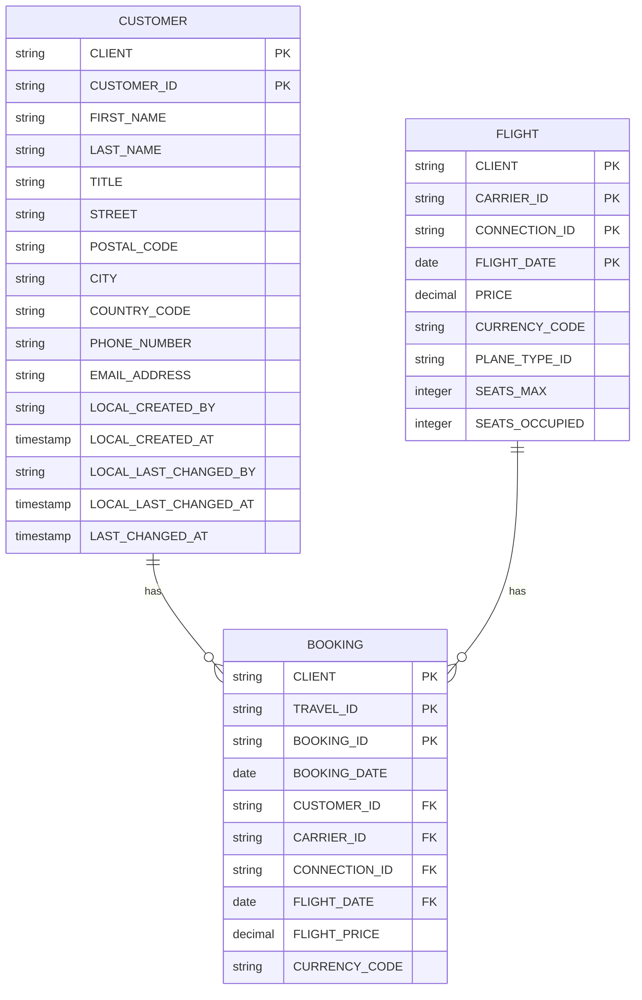

# Flight Reference Scenario - Database Schema Diagram

## Table Relationships

This diagram shows the entity relationships between the three core tables in the Flight Reference Scenario database schema.



## Detailed Relationships

### CUSTOMER to BOOKING (One-to-Many)
- **Relationship Type**: One customer can have multiple bookings
- **Foreign Key**: `BOOKING.CUSTOMER_ID` → `CUSTOMER.CUSTOMER_ID`
- **Join Condition**: 
  ```sql
  BOOKING.CLIENT = CUSTOMER.CLIENT 
  AND BOOKING.CUSTOMER_ID = CUSTOMER.CUSTOMER_ID
  ```

### FLIGHT to BOOKING (One-to-Many)
- **Relationship Type**: One flight can have multiple bookings
- **Foreign Keys** (Composite):
  - `BOOKING.CARRIER_ID` → `FLIGHT.CARRIER_ID`
  - `BOOKING.CONNECTION_ID` → `FLIGHT.CONNECTION_ID`
  - `BOOKING.FLIGHT_DATE` → `FLIGHT.FLIGHT_DATE`
- **Join Condition**:
  ```sql
  BOOKING.CLIENT = FLIGHT.CLIENT
  AND BOOKING.CARRIER_ID = FLIGHT.CARRIER_ID
  AND BOOKING.CONNECTION_ID = FLIGHT.CONNECTION_ID
  AND BOOKING.FLIGHT_DATE = FLIGHT.FLIGHT_DATE
  ```

## Table Descriptions

### /DMO/CUSTOMER
- **Purpose**: Stores customer information for the flight reference scenario
- **Type**: Transparent table (TRANSP)
- **Primary Key**: CLIENT + CUSTOMER_ID
- **Fields**: 16 total (2 key + 14 data/audit fields)
- **Description**: Flight Reference Scenario: Managing Customers

### /DMO/FLIGHT
- **Purpose**: Stores flight information including pricing and seat availability
- **Type**: Transparent table (TRANSP)
- **Primary Key**: CLIENT + CARRIER_ID + CONNECTION_ID + FLIGHT_DATE
- **Fields**: 9 total (4 key + 5 data fields)
- **Description**: Flight Reference Scenario: Flight

### /DMO/BOOKING
- **Purpose**: Stores booking records linking customers to flights
- **Type**: Transparent table (TRANSP)
- **Primary Key**: CLIENT + TRAVEL_ID + BOOKING_ID
- **Fields**: 10 total (3 key + 7 data fields from included BOOKING_DATA table)
- **Description**: Flight Reference Scenario: Booking
- **Includes**: Data from `/DMO/BOOKING_DATA` table

## Key Features

- **Client-Dependent**: All tables include CLIENT as part of their primary key for multi-tenancy support
- **Audit Trail**: CUSTOMER table includes audit fields (created by/at, last changed by/at)
- **Currency Support**: BOOKING and FLIGHT tables track prices with currency codes
- **Seat Management**: FLIGHT table tracks maximum and occupied seats for capacity management
- **Data Integrity**: Foreign key relationships ensure referential integrity across the schema

## Related Tables in Flight Reference Scenario

The Flight Reference Scenario includes several additional tables that work together with the core three tables above:

- **/DMO/TRAVEL**: Main travel/trip header table for grouping bookings
- **/DMO/BOOKING_SUPPLEMENT**: Supplementary services/add-ons for bookings
- **/DMO/AIRPORT**: Airport master data (codes, names, cities)
- **/DMO/CONNECTION**: Flight connection information (routes between airports)
- **/DMO/AGENCY**: Travel agency information
- **/DMO/TRVL_STAT**: Travel status information
- **/DMO/BOOK_SUPPL**: Booking supplement configurations

For a comprehensive overview of the Flight Reference Scenario and these tables, refer to SAP's official documentation:

📖 **SAP Documentation Reference**: 
[Flight Reference Scenario - ABAP RESTful Application Programming Model (RAP)](https://help.sap.com/docs/ABAP_PLATFORM_NEW/fc4c71aa50014fd1b43721701471913d/a9d7c7c140a0408dbc5966c52d156b49.html?locale=en-US&version=202510.001)

This reference includes:
- Complete data model specifications
- Table structures and field definitions
- Relationships and constraints
- Business logic and processing rules
- Implementation guidelines for RAP applications
- Best practices for extending the scenario

## Source Information

This diagram is based on the abapGit export from the ABAP-platform-2025 branch, containing SAP S/4HANA Flight Reference Scenario objects exported via abapGit integration.
